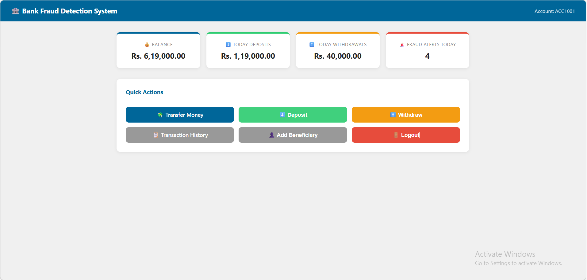
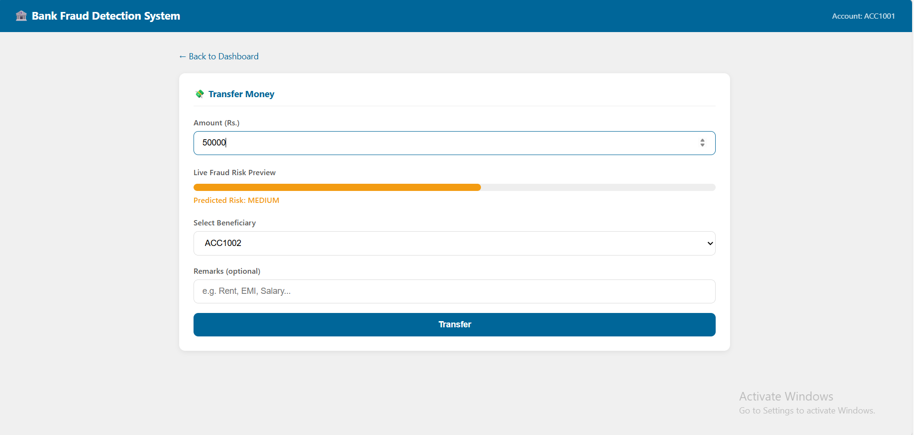
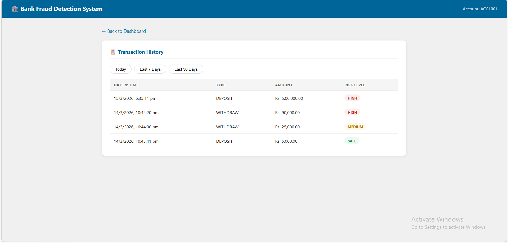

# 🏦 Bank Fraud Detection System

> A student project that detects suspicious banking transactions in real time using Machine Learning, Java, MySQL, and a web-based frontend.


  

---

## 🛠️ Tech Stack

| Layer | Technology |
|---|---|
| Backend | Java (HttpServer — no frameworks) |
| Machine Learning | Python, Flask, scikit-learn (Random Forest) |
| Database | MySQL 8.0 |
| Frontend | HTML5, CSS3, JavaScript |

---

## 📁 Project Structure

```
FraudDetectionSystem/
├── Main.java                    ← Banking logic + ML API call
├── BankServer.java              ← REST API server (port 8080)
├── mysql-connector-j-9.6.0.jar ← MySQL JDBC driver
├── login.html                   ← Login page
├── dashboard.html               ← Balance + stats + actions
├── transfer.html                ← Transfer with live risk bar
├── history.html                 ← Transaction history
├── styles.css                   ← All styles
├── app.js                       ← Alerts, buzzer, API calls
├── fraud_api.py                 ← Python ML server (port 5000)
├── train_model.py               ← Train the model
├── fraud_dataset.csv            ← 450-row training data
├── fraud_model.pkl              ← Trained model (auto-generated)
├── schema.sql                   ← Database setup
└── requirements.txt             ← Python packages
```

---

## 🗄️ Database — fraud_bank

| Table | Key Columns |
|---|---|
| customers | customer_id, name, phone, email |
| accounts | account_number, customer_id, balance, account_type, pin |
| beneficiaries | beneficiary_id, account_number, beneficiary_account, added_time |
| transactions | transaction_id, account_number, amount, transaction_type, transaction_time, risk_level |
| fraud_alerts | alert_id, account_number, reason, risk_level, alert_time |

---

## 🤖 Fraud Detection

**ML Model:** Random Forest trained on 6 features — `amount`, `avg_amount`, `hour`, `recent_txn`, `beneficiary_recent`, `amount_ratio`

**Extra rules in Java:**

| Rule | Trigger | Effect |
|---|---|---|
| Midnight | Transaction between 10 PM – 6 AM | Risk upgraded |
| Rapid | 3+ transactions within 1 minute | Risk upgraded |
| Large at night | Amount > Rs.50,000 at night | Always HIGH |

**Risk levels:** SAFE → green popup &nbsp;|&nbsp; MEDIUM → orange popup &nbsp;|&nbsp; HIGH → red popup + buzzer alarm

  

---

## ⚙️ First Time Setup

**1. Create database — paste into MySQL Command Line:**
```sql
CREATE DATABASE IF NOT EXISTS fraud_bank;
USE fraud_bank;
-- then paste the contents of schema.sql
```

**2. Insert test data:**
```sql
INSERT INTO customers (name, phone, email) VALUES
('Divya','9876543210','divya@email.com'),
('Ravi','9123456780','ravi@email.com'),
('Sneha','9012345678','sneha@email.com');

INSERT INTO accounts (account_number, customer_id, balance, account_type, pin) VALUES
('ACC1001',1,150000,'Savings','1234'),
('ACC1002',2,50000,'Savings','2345'),
('ACC1003',3,20000,'Current','3456');

INSERT INTO beneficiaries (account_number, beneficiary_account) VALUES
('ACC1001','ACC1002'),('ACC1001','ACC1003'),('ACC1002','ACC1001');
```

**3. Install Python packages:**
```bash
pip install -r requirements.txt
```

**4. Train the model (once only):**
```bash
python train_model.py
```

---

## ▶️ How to Run

Open **2 terminals** in the project folder:

**Terminal 1 — Python ML server:**
```bash
python fraud_api.py
```
✅ `Running at http://localhost:5000`

**Terminal 2 — Java backend:**

Windows:
```powershell
javac -cp ".;mysql-connector-j-9.6.0.jar" Main.java BankServer.java
java  -cp ".;mysql-connector-j-9.6.0.jar" BankServer
```
Mac/Linux:
```bash
javac -cp .:mysql-connector-j-9.6.0.jar Main.java BankServer.java
java  -cp .:mysql-connector-j-9.6.0.jar BankServer
```
✅ `Server running at http://localhost:8080`

Then open `login.html` in Chrome or Firefox.

---

## 🔑 Test Accounts

| Account | PIN | Balance |
|---|---|---|
| ACC1001 | 1234 | Rs. 1,50,000 |
| ACC1002 | 2345 | Rs. 85,000 |
| ACC1003 | 3456 | Rs. 42,000 |

---

## 🧪 Quick Test Guide


 

| Action | Amount | Expected |
|---|---|---|
| Deposit / Withdraw | Rs. 5,000 | ✅ Green popup — SAFE |
| Deposit / Withdraw | Rs. 30,000 | 🟠 Orange popup — MEDIUM |
| Deposit / Withdraw | Rs. 90,000 | 🔴 Red popup + Buzzer — HIGH |
| Transfer page | Type any amount | Risk bar changes colour live |
| 3 quick deposits | Within 1 minute | 3rd triggers MEDIUM or HIGH |

---

## 🔗 How It Works

```
Browser → Java BankServer (8080) → MySQL (balance, save transaction)
                    ↓
          Python ML Server (5000) → predict SAFE / MEDIUM / HIGH
                    ↓
          Apply Java rules (midnight, rapid transactions)
                    ↓
          Return risk to browser → show popup + buzzer
```




---

## ❌ Common Errors

| Error | Fix |
|---|---|
| "Cannot connect to server" | Start Java BankServer first |
| Login fails | Use ACC1001 format, check MySQL is running |
| No buzzer sound | Click anywhere on page first (browser audio policy) |
| `fraud_model.pkl not found` | Run `python train_model.py` |
| Compile error on Windows | Use quotes: `".;mysql-connector..."` |
| Fraud alerts count shows 0 | Check BankServer uses `alert_time` not `created_at` |

---

## 📝 Notes

- Academic project — PIN stored as plain text, not for production use
- ML model accuracy is 100% on synthetic dataset — real data would differ
- All files must stay in the same folder